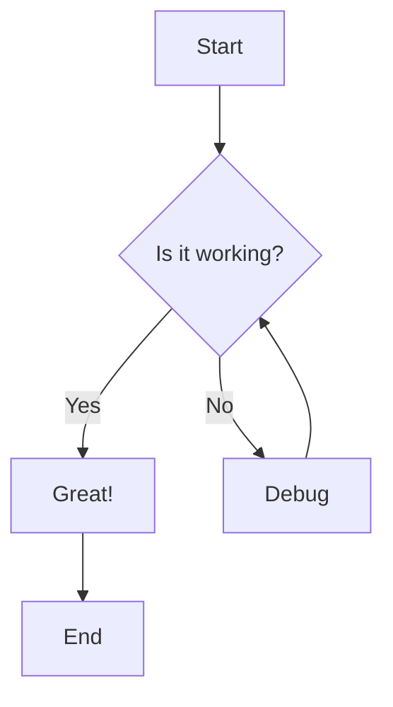
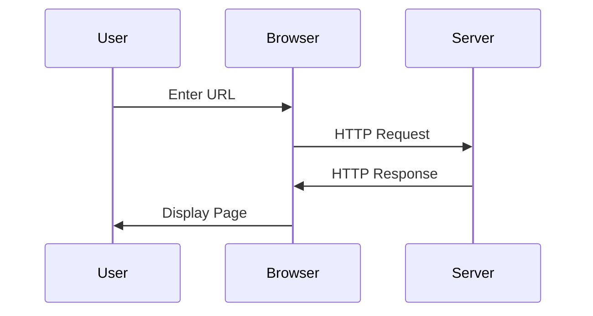

# Modern Markdown Showcase 🚀

This document demonstrates modern markdown features and GitHub-flavored markdown syntax.

## Basic Formatting

### Text Styles
**Bold text** and __alternative bold__  
*Italic text* and _alternative italic_  
~~Strikethrough text~~  
`Inline code`  
==Highlighted text== (if supported)

### Headings with Custom IDs {#custom-heading}

You can link to [this heading](#custom-heading) using the custom ID.

## GitHub-Flavored Markdown

### Task Lists
- [x] Completed task
- [ ] Incomplete task
- [x] ~~Cancelled task~~
- [ ] Task with **bold** and *italic* text

### Alerts (GitHub)
> [!NOTE]
> Useful information that users should know, even when skimming content.

> [!TIP]
> Helpful advice for doing things better or more easily.

> [!IMPORTANT]
> Key information users need to know to achieve their goal.

> [!WARNING]
> Urgent info that needs immediate user attention to avoid problems.

> [!CAUTION]
> Advises about risks or negative outcomes of certain actions.

## Advanced Code Features

### Syntax Highlighting with Line Numbers
```typescript
// Modern TypeScript with async/await
interface ApiResponse<T> {
  data: T;
  status: number;
  message: string;
}

async function fetchUserData(id: string): Promise<ApiResponse<User>> {
  try {
    const response = await fetch(`/api/users/${id}`);
    return await response.json();
  } catch (error) {
    throw new Error(`Failed to fetch user: ${error.message}`);
  }
}
```

### Code with Diff Highlighting
```diff
function calculateTotal(items) {
- return items.reduce((sum, item) => sum + item.price, 0);
+ return items.reduce((sum, item) => sum + (item.price * item.quantity), 0);
}
```

### Shell Commands
```bash
# Install dependencies
npm install

# Run development server
npm run dev

# Build for production
npm run build
```

## Modern Tables

| Feature | Support | Notes |
|---------|---------|-------|
| GitHub Flavored Markdown | ✅ | Full support |
| Math Expressions | ⚠️ | Depends on renderer |
| Mermaid Diagrams | ✅ | GitHub native |
| Task Lists | ✅ | Interactive on GitHub |

### Table with Alignment
| Left Aligned | Center Aligned | Right Aligned |
|:-------------|:--------------:|--------------:|
| Content      | Content        | Content       |
| More         | More           | More          |

## Lists and Navigation

### Nested Lists with Mixed Types
1. First ordered item
2. Second ordered item
   - Unordered sub item
   - Another sub item
     1. Nested ordered
     2. Another nested
3. Third ordered item

### Definition Lists (if supported)
Term 1
: Definition for term 1

Term 2
: Definition for term 2
: Alternative definition for term 2

## Links and References

### Modern Link Formats
- [Regular link](https://github.com)
- [Link with title](https://github.com "GitHub Homepage")
- [Relative link to file](./CLAUDE.md)
- [Reference-style link][ref-link]
- <https://github.com> (automatic link)

[ref-link]: https://github.com "Reference link"

### Email and Issues
- Contact: <user@example.com>
- Issue reference: #123 (if in GitHub)
- User mention: @username (if in GitHub)

## Media and Embeds

### Image with Reference
![GitHub Logo][github-logo]

[github-logo]: https://github.githubassets.com/images/modules/logos_page/GitHub-Mark.png "GitHub Logo"

## Mathematical Expressions

Inline math: $E = mc^2$

Block math:
$$
\sum_{i=1}^{n} x_i = x_1 + x_2 + \cdots + x_n
$$

## Diagrams (Mermaid)



### Sequence Diagram


## Footnotes and Citations

This is a statement that needs a citation[^1].

Here's another statement with a longer footnote[^long-note].

[^1]: This is a simple footnote.

[^long-note]: This is a longer footnote with multiple lines.
    
    It can even contain code blocks:
    
    ```
    console.log('Hello from footnote!');
    ```

## Modern Blockquotes

### Simple Quote
> "The best way to predict the future is to invent it."
> — Alan Kay

### Nested Quotes with Attribution
> "Innovation distinguishes between a leader and a follower."
>
> > This quote is often attributed to Steve Jobs, though the exact source is debated.

## Special Characters and Escaping

### HTML Entities
&copy; 2024 &mdash; All rights reserved &trade;

### Escaping Special Characters
\*This text is not italic\*  
\`This is not code\`  
\## This is not a heading

## Horizontal Rules

Standard rule:
---

Thicker rule:
***

Dotted rule (if supported):
___

## Advanced Features

### Collapsible Sections (HTML in Markdown)
<details>
<summary>Click to expand</summary>

This content is hidden by default and can be expanded by clicking the summary.

```javascript
console.log('Hidden code block!');
```

</details>

### Keyboard Shortcuts
Press <kbd>Ctrl</kbd> + <kbd>C</kbd> to copy  
Use <kbd>⌘</kbd> + <kbd>V</kbd> to paste on Mac
